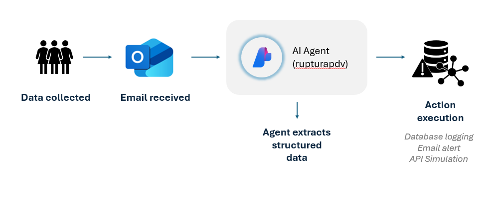

# Agents-AzureAIFoundry
**Intelligent agent framework built on Microsoft Azure AI Foundry.** 

This repository hosts the *rupturapdv* project, featuring a single active agent designed to detect and respond to product stockouts in retail locations by parsing emails, extracting structured data, and triggering automated actions.

## Features
- **AI-Powered Email Parsing:** Agent extracts rupture data from unstructured email content.
- **Structured JSON Output:** Returns a consistent schema with fields like PDV, product, client, and recommended actions.
- **Automated Action Execution:** Executes actions such as database logging, email alerts, and API calls based on agent output.
- **Microsoft Graph Integration:** Secure email reading and dispatch using OAuth2 and Graph API.
- **SQLite Persistence:** Local database stores rupture events for analysis.
- **API Simulation (placeholder):** Demand creation is currently mocked for testing purposes until the real API is available.
- **Hybrid Recurrence Rule:** Even if the agent does not recommend, the code triggers alerts when recurrence is detected locally.

## Installation
### Dependencies

- Python 3.11+
- Microsoft Graph API (OAuth2)
- Azure AI Foundry (agent: *rupturapdv*)
- SQLite (included by default)
- Microsoft 365 account (for Graph API access)

### Development Environment

- Visual Studio Code (v1.106.0)
- Python 3.14.0

## Usage
### 1. Configure Microsoft Graph Autentication
Set up OAuth2 credentials and ensure the following scopes are granted:

``Mail.ReadWrite``


### 2. Run the Email Reader
Execute:

```email_reader.py```

⚠️ Replace ``YOUR_CLIENT_ID``, ``YOUR_TENANT_ID`` and ``YOUR_FOLDER_ID`` with your actual credentials.
This script:
- Reads unread emails from the **Rupturas** folder.
- Extracts content and forwards it to the agent.
- Marks emails as read after processing.
  
> 📂 Note: The **Rupturas** folder should contain only stockout-related messages to ensure accurate parsing and action triggering.
> Emails outside this context may lead to irrelevant or failed agent responses.

### 3. Agent Response and Action Execution
The agent returns a structured JSON like:

```
{
    "Nome do PDV": "Central Market - Unidade BH",
    "Endereço do PDV": "Rua XYZ",
    "Produto afetado": "Detergente",
    "Nome do cliente": "Empresa 1",
    "Cliente possui serviço de reposição": "Sim",
    "E-mail do gerente da conta": "gerente@empresa1.com",
    "Ações recomendadas": [
      "Registrar evento de ruptura",
      "Enviar email alerta",
      "Criar demanda via API para promotor"
    ],
    "Justificativas": {
      "Registrar evento de ruptura": "O produto está em falta e precisa ser registrado para análise futura.",
      "Enviar email alerta": "Foi verificada recorrência de ruptura de produto e o gerente precisa ser notificado.",
      "Criar demanda via API para promotor": "A loja está sem estoque e precisa de reposição."
    },
    "Canais de execução": {
      "Registrar evento de ruptura": "banco de dados",
      "Enviar email alerta": "e-mail",
      "Criar demanda via API para promotor": "API"
    }
  }
```

The system then:
- Logs the event in a local SQLite database for recurrence analysis
- Simulates an alert notification to the account manager if recurrence is detected (hybrid rule).
- Simulates demand creation via API for clients with replenishment service.

## Agent Configuration
- **Agent name:** ``rupturapdv```
- **Objective:** Interpret emails reporting product stockouts at retail points of sale and recommend corrective actions based on business rules and context.
- **LLM Model:** ``gpt.4o.mini (version: 2024/07/18)``
- **Knowledge Sources:**
  The agent is configured with the following knowledge bases and references:
    - **Clients with automatic stockout replenishment service**
    Used to determine whether demand creation should be triggered automatically.
    - **Point‑of‑sale (PoS) addresses**
    Ensures correct identification of store locations and supports recurrence detection.
    - **Account managers’ emails**
    Enables proactive contact in case of recurring rupture events (currently simulated alerts).
    - **Example JSON output instructions**
    Provides schema guidance so the agent always returns structured, predictable fields.
    - **Business rules and operational guidelines**
    Defines when to log events, trigger alerts, or simulate demand creation, ensuring consistency with retail processes.

### Configuration Note

⚠️ Replace `<your-resource-name>`, `<your-project-name>`, and `<your-agent-id>` in `agent_client.py` with your actual Azure AI Foundry configuration before running.


### LGPD (General Data Protection Law)
This project handles sensitive information such as client names, email addresses, and store locations.  
To comply with data protection regulations, the actual `.txt` knowledge files containing personal data are not included and will not be versioned in this repository.  
Instead, a simplified example file is provided for demonstration purposes, containing only fictitious or anonymized data.

### System Instructions
The agent is instructed to:
- Extract fields such as PoS name, product, client, and stockout occurrence
- Return structured JSON with recommended actions
- Justify each action and specify the execution channel
- Prioritize actions based on client data and business rules

### Data Integrity Rules
- Recurrence is detected by the combination:
    - Product
    - Client
    - Store (PoS) name

To ensure correct recurrence analysis, the store name (PoS) must always be unique and distinct across the database.
- Never reuse the same store name for different PoS entries.
- If two stores belong to the same client, use a clear naming convention (e.g., include neighborhood, branch number, or internal code).

**Examples:**

✅ Correct:
- ``Central Supermarket - Downtown Branch``
  
- ``Central Supermarket - South Zone Branch``
  
❌ Incorrect (not allowed):
- ``Central Supermarket (used for more than one branch)``

## Visual Schema
This diagram illustrates the end-to-end flow of the rupturapdv agent, from email ingestion to action execution:
- **Email Received** → via Microsoft Graph API
- **Email Parsed** → agent extracts structured data
- **Agent Response** → JSON with recommended actions
- **Action Execution** → database logging, simulated alerts, API simulation
- **Persistence & Audit** → rupture events stored in SQLite



## Screenshots
Please see screenshots illustrating the agent in the ``assets/`` folder of this repository. Some examples below:
1. **Agent setup** – instructions, description, and knowledge sources

📂 Path: [Agent Setup](assets/ConfigAgent.png)

2. Agent response

📂 Path: [Structured JSON output](assets/playgroundJSON.png)

3. Stockout event – logged in SQLite

📂 Path: [Local Database Example](assets/localdbexample.png)

## Security and Permissions
OAuth2 Scopes
- Mail.ReadWrite: Read emails, and mark them as read

## Network
- Communication only via HTTPS (port 443).
- Integrates with Microsoft Graph and Azure AI Foundry.
- Promoter API planned.

## Dependencies
- ``azure-ai-projects``
- ``msal``
- ``sqlite3``
- ``json``
- ``datetime``, ``time``, ``logging``, ``re``

## Mapped Improvements
The following enhancements have been identified for future iterations:

- **Automated Scheduling**: Enable the email reader routine to run automatically at defined intervals (e.g., via cron job, task scheduler, or background service), removing the need for manual execution.
- **Dynamic Folder Detection**: Replace hardcoded folder ID with automatic lookup by name or metadata.
- **Environment Variable Support**: Move sensitive credentials and configuration to `.env` files for better security.
- **Error Handling**: Improve resilience against malformed emails, empty fields, or failed API responses.
- **Multi-Agent Support**: Extend architecture to support multiple agents for different business contexts.
- **Dashboard Integration**: Visualize rupture events and agent responses in a web-based dashboard.
- **Real API Integration**: Replace simulated demand creation with live integration to the Promotor API.
- **Alert Analysis by Agent**: Move beyond simulated alerts by allowing the agent to evaluate recurrence and decide when to notify account managers, integrating with Microsoft Graph for real email dispatch.
- **Unit Tests**: Add automated tests for email parsing, agent communication, and action execution.
  
## Acknowledgements
- Built on **Microsoft Azure AI Foundry**  
- Utilizes **Microsoft Graph API** for email handling
- Inspired by real-world retail stockout management challenges

## Disclaimer
This project is educational and demonstrative. It is not intended for production use without further development, testing, and security review.

## Contributions and contact
Contributions are welcome! Open issues or pull requests for bug fixes, enhancements, or new features.

**Contact:** Manuella Paez
